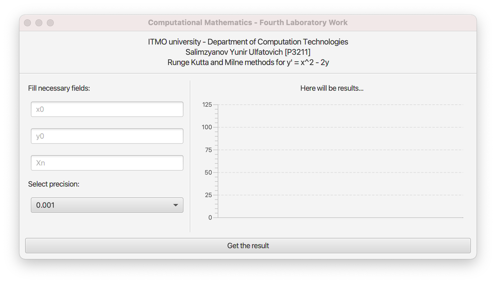

## Synopsis
Ordinary differential equation - Cauchy problem.
Milne's method. 

**Input:** 
- start values (x0 and y0)
- the end value (Xn)
- precision

**Output:**
- step
- graphical representation

## Preview
